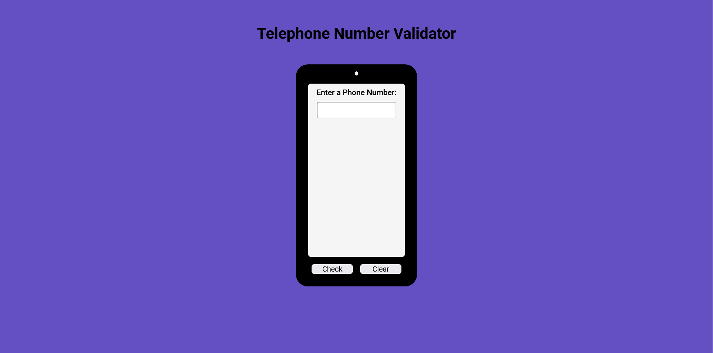

# Telephone Number Validator

This project is an interactive web application built as part of the freeCodeCamp JavaScript Algorithms and Data Structures Certification. It validates whether a given input is a valid US phone number, featuring a clean and mobile-friendly interface to ensure data accuracy and enhance user experience.

## Table of contents

- [Telephone Number Validator](#telephone-number-validator)
  - [Table of contents](#table-of-contents)
  - [Overview](#overview)
    - [Screenshot](#screenshot)
    - [Links](#links)
    - [Features](#features)
    - [Built with](#built-with)
    - [What I learned](#what-i-learned)
    - [Useful resources](#useful-resources)
  - [Author](#author)
  - [Acknowledgments](#acknowledgments)

## Overview

This project allows users to:
- Enter a phone number and check if it is a valid US number.
- Clear results and reset the input field for a seamless user experience.
- Get real-time feedback on the validity of their input.

### Screenshot



### Links

- Live Site URL: [DT Code](https://telephone-number-validator.dtcode.se/)

### Features

- Real-time Validation: Users receive immediate feedback on whether the input is a valid US phone number, using regex-based logic.
- Interactive Buttons: Dedicated "Check" and "Clear" buttons to validate input or reset the form for a seamless experience.
- Dynamic Feedback: Results are displayed directly on the simulated phone interface for better visualization.
- Responsive Design: A visually appealing and mobile-friendly design that mimics the look of a modern smartphone.
- Error Handling: Clear and concise messages are displayed for invalid inputs to guide the user effectively.

### Built with

- HTML5 for structure
- CSS3 for styling
  - Google Fonts for typography
  - Hover effects for interactive buttons
- JavaScript (ES6+) for functionality
  - Regular expressions for phone number validation
  - Event listeners for user interactions

### What I learned

This project taught me:
- How to use regular expressions to validate specific input formats, like phone numbers.
- The importance of clear user feedback and a clean UI for enhanced user experience.
- Best practices for writing modular and maintainable JavaScript code.
- Dynamic DOM manipulation to provide real-time results.

The following regular expression checks for valid US phone numbers, supporting various formats such as (555) 555-5555, 555-555-5555, or 555 555 5555.

```js
function validatePhoneNumber(phoneNumber) {
    // Test formats: (555) 555-5555, 555-555-5555, 555 555 5555
    let regex = /^1?\s?(\d{3}|\(\d{3}\))-?\s?\d{3}-?\s?\d{4}$/gm;
    if (regex.test(phoneNumber)) {
        resultsEl.textContent = `Valid US number: ${phoneNumber}`;
    } else {
        resultsEl.textContent = `Invalid US number: ${phoneNumber}`;
    }
}
```

Additionally, I learned how regex can complement other input validation techniques to ensure high data integrity.

### Useful resources

- [MDN Web Docs: Regular Expressions](https://developer.mozilla.org/en-US/docs/Web/JavaScript/Guide/Regular_expressions) - Explains how to use regex in JavaScript.
- [Regex101](https://regex101.com/) - A useful tool for testing and understanding regex patterns.

## Author

- GitHub - [@dantvi](https://github.com/dantvi)
- LinkedIn - [@danieltving](https://www.linkedin.com/in/danieltving/)

## Acknowledgments

Special thanks to freeCodeCamp and other online resources for providing the inspiration and guidance to build this project.
